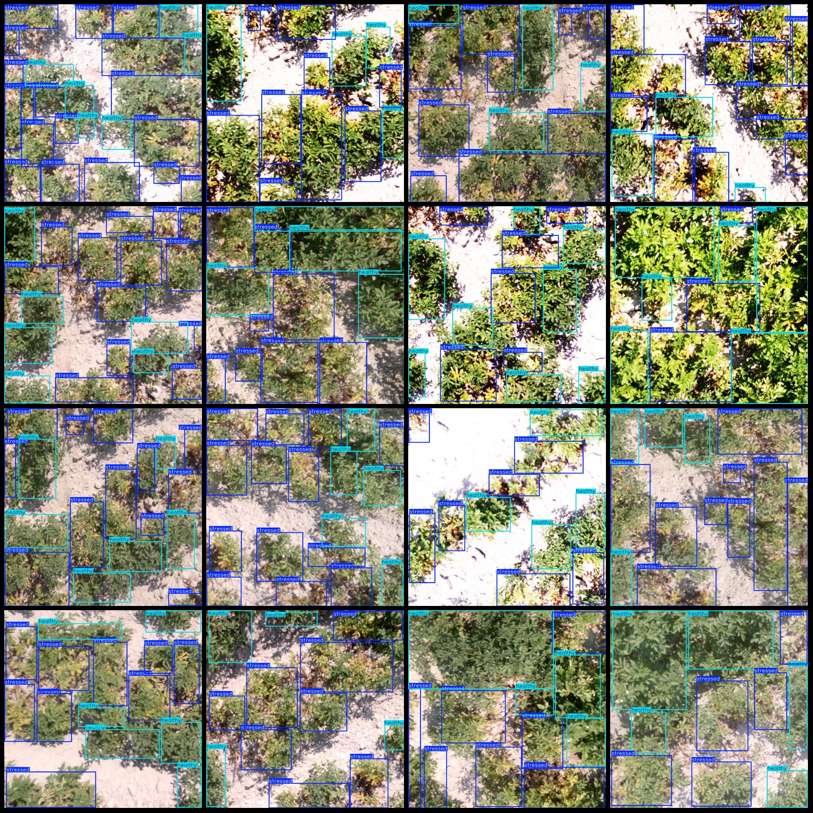
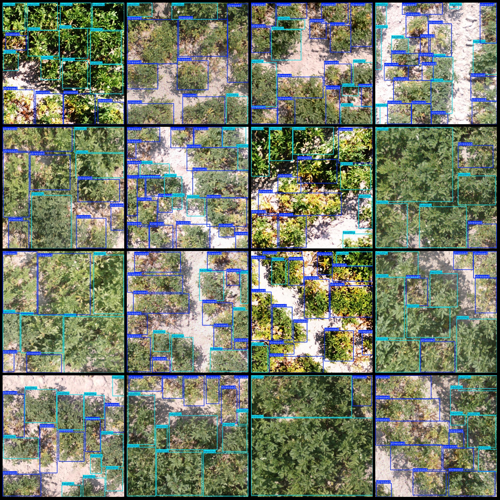
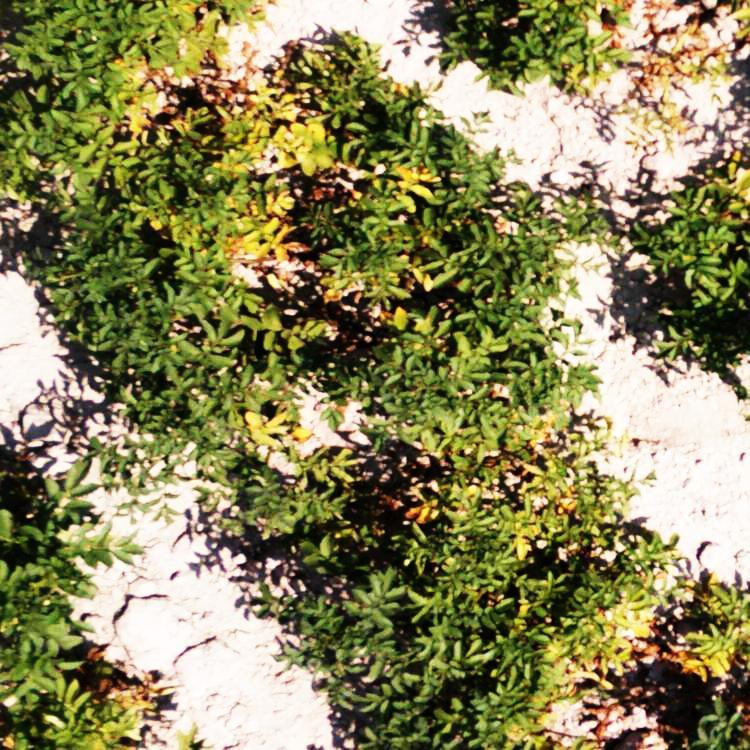
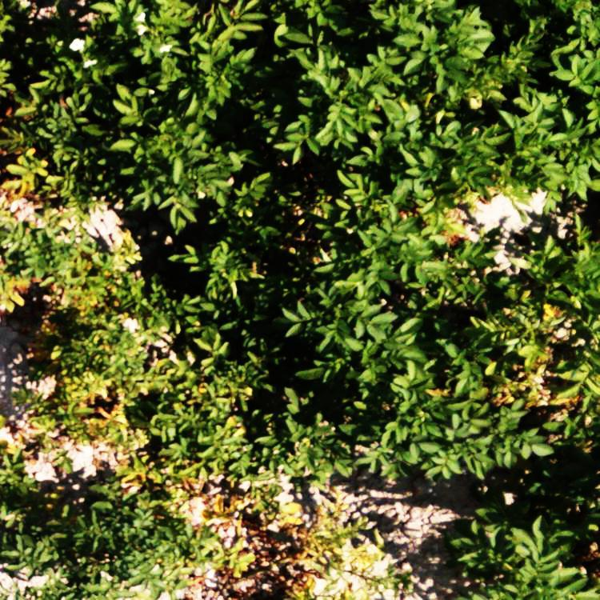

# Drone-View Plant Disease Detection Dataset VOC+YOLO Format, 1539 Images in 2 Categories

Please note that the images in the dataset appear somewhat unclear overall. See the below image for a close-up view.

**Dataset Format:** Pascal VOC format + YOLO format (without the split path's txt file, just containing jpg images and corresponding VOC format xml files and YOLO format txt files)

**Image Count (jpg Files):** 1539

**Annotation Count (Xml Files):** 1539

**Annotation Count (Txt Files):** 1539

**Annotation Category Count:** 2

**Annotation Category Names (Note that the order of categories in the YOLO format does not match this, but is based on the classes.txt in the labels folder):** ["healthy", "stressed"]

**Number of Boxes per Category:**

- Healthy (Healthy) Boxes = 8478
- Stressed (Affected Plant) Boxes = 12436

**Total Boxes:** 20914

**Image Resolution:** 750x750

**Drone: DJI Mavic Pro**

**Collection Height:** 2-10m

**Collection Angle:** 90°

**Annotation Tool:** labelImg

**Annotation Rules:** Draw boxes around categories

**Important Notes:** None provided.

**Special Declaration:** This dataset does not guarantee the accuracy of the trained models or weight files.

**Image Preview:** 

**Annotation Example:** 

**Overall Image Quality:** Representative of similar clarity as shown in the image preview.

## Images

Here is a pay link on Stripe ( https://buy.stripe.com/3cs8yP7sY87d0vu9AB ). Please contact me lonlonago@foxmail.com after funding $89, and I will send you a complete data files , thank you!

